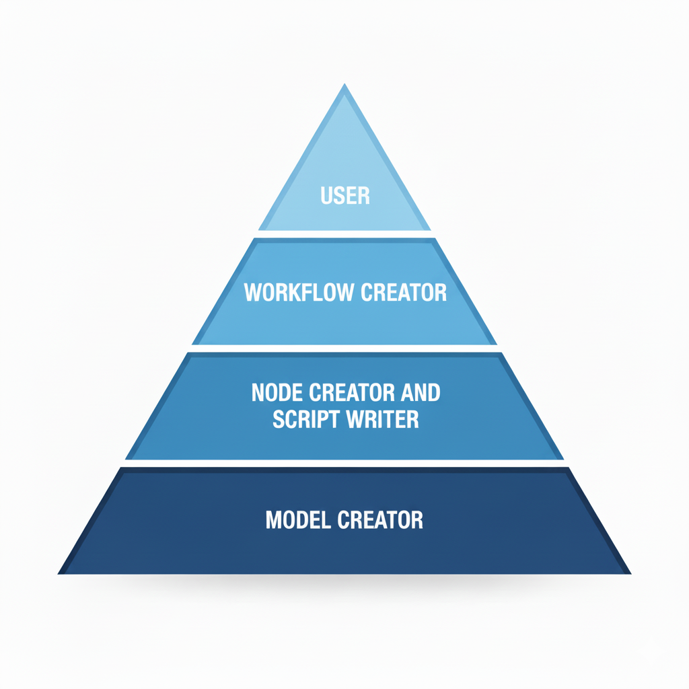
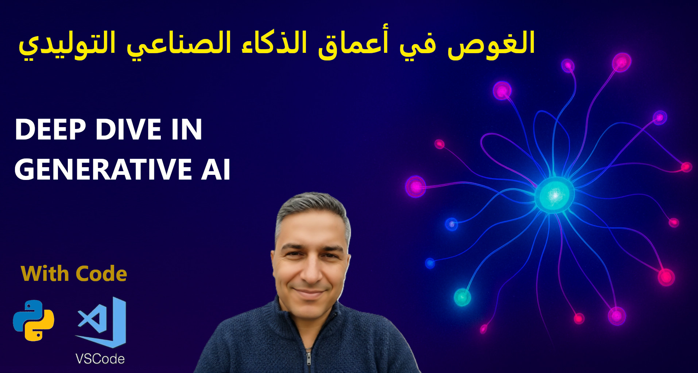
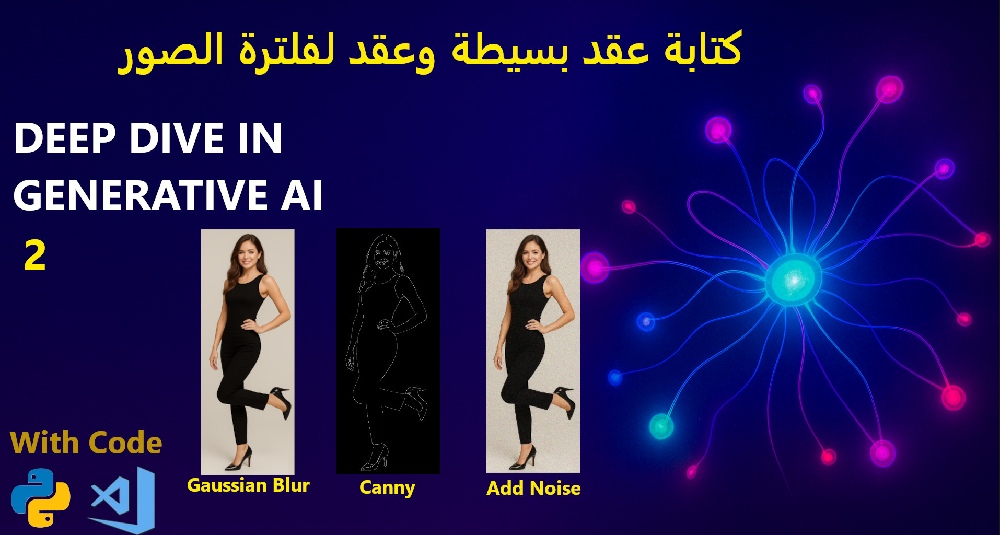
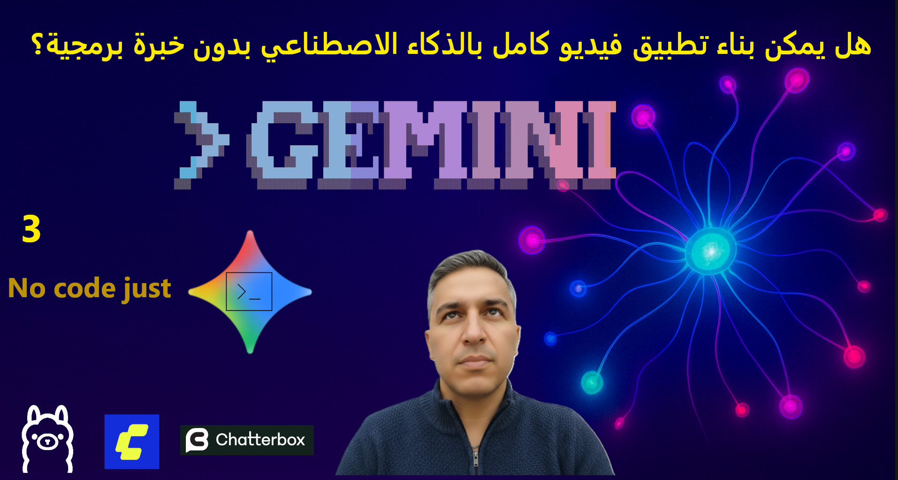

# Deep Dive in Generative AI

## Course Content

Below is a list of the videos and topics covered in this repository:

### 1. Generative AI introduction: Levels of generative AI users and developers
An overview of the Generative AI landscape, defining the different tiers of interaction ranging from end-users to core model developers.
 

### 2. Writing custom ComfyUI nodes (image processing examples)
Practical examples and code for extending ComfyUI by creating custom nodes to handle sophisticated image processing workflows.
 

### 3. Building AI applications using Gemini CLI
Tutorial on how to build and integrate AI capabilities into applications using the Gemini Command Line Interface.
 

### 4. Variational autoencoders, latent space, and editing face images in the latent space
A deep dive into VAE architecture, understanding how latent space works, and demonstrating how to edit facial features by manipulating latent vectors.
 <video src="imgs/vid04.mp4" width="600" controls="" muted="" autoplay="" type="video/mp4" >

https://github.com/user-attachments/assets/d7bf54b7-cc5a-4b5e-bbc4-9e390f4c0ac1

